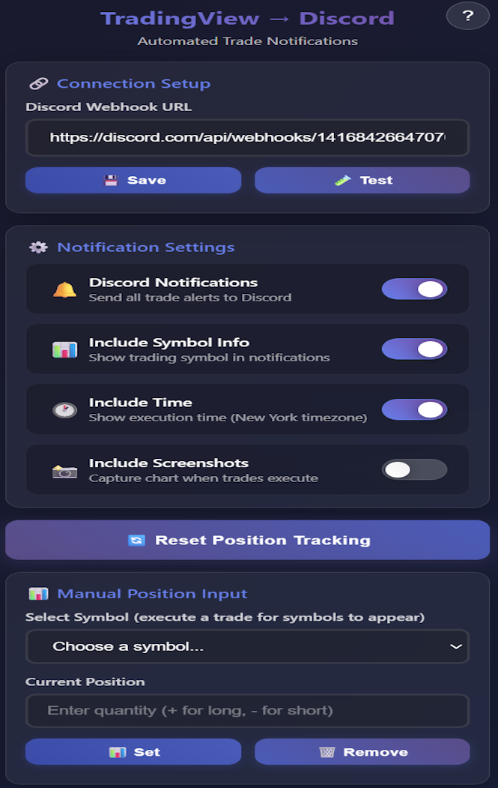
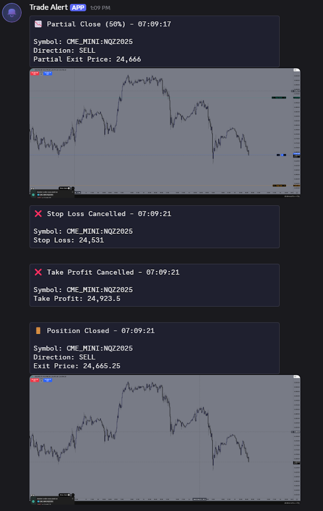

# TradingView to Discord Browser Extension

Automatically send your TradingView trade executions directly to Discord with optional screenshot capture.

## ✨ Features

- **🔔 Real-time Notifications** - Automatically detects and forwards all TradingView trade details to Discord
- **📊 Position Tracking** - Tracks your positions and identifies partial closes, full exits, and position reversals
- **📸 Screenshot Capture** - Optionally capture and send TradingView chart screenshots when trades execute
- **⚙️ Customizable Settings** - Toggle notifications, symbol info, and screenshots on/off
- **🎯 Multiple Order Types** - Supports market orders, limit orders, stop losses, take profits, and more
- **🔄 Position Management** - Reset position tracking when needed
- **📊 Manual Position Input** - Set positions manually for cross-device synchronization
- **🧪 Test Integration** - Built-in webhook testing to verify your setup

## 🚀 Quick Start

### 1. Install the Extension

**🌐 Browser Compatibility**: Works with Chromium-based browsers.

1. [Download](https://github.com/Ufonose/tradingview-to-discord-alerts/releases/tag/v0.2) & Extract the ZIP file
2. Open your browser and go to the extensions page:
   - **Chrome**: `chrome://extensions/`
   - **Brave**: `brave://extensions/`
3. Enable "Developer mode" (toggle in top right)
4. Click "Load unpacked" and select the **extracted folder containing the files**
5. The extension should be added to your browser's extension list
6. **📌 Recommended**: Pin the extension to your toolbar for easy access to settings

### 2. Set Up Discord Webhook

1. In your Discord server, go to **Server Settings** → **Integrations** → **Webhooks**
2. Click **Create Webhook** or **New Webhook**
3. Choose the channel where you want trade notifications
4. Copy the **Webhook URL** (starts with `https://discord.com/api/webhooks/...`)

### 3. Configure the Extension

1. Click the extension icon in your browser toolbar
2. Paste your Discord webhook URL in the "Discord Webhook URL" field
3. Click **💾 Save**
4. Click **🧪 Test** to verify the connection works
5. Configure your notification preferences:
   - **🔔 Discord Notifications** - Master on/off switch
   - **📊 Include Symbol Info** - Show trading symbols in notifications
   - **📸 Include Screenshots** - Capture charts when trades execute

### 4. Setup (Recommended)

For best results at the start of each browser session:

1. **Refresh TradingView** - Reload your TradingView tab to ensure clean extension initialization
2. **Reset Position Data** - If you're starting flat (no open positions):
   - Click the extension icon
   - Click **🔄 Reset Position Tracking**
   - This ensures accurate position detection from the start

## 📸 Screenshots

  
  
  

## ⚙️ Settings Guide

### 🔔 Discord Notifications
Master switch for all trade alerts. When disabled, no notifications will be sent regardless of other settings.

### 📊 Include Symbol Info  
Shows the trading symbol (AAPL, TSLA, EURUSD, etc.) in notifications. Helpful for identifying which asset the trade is for.

### 📸 Include Screenshots
Automatically captures TradingView chart screenshots when trades execute.

**Important**: Screenshots require:
- TradingView to be the active browser tab
- Clicking the extension icon once per browser session to activate permissions
- After activation, screenshots work automatically

**⚠️ Privacy Note**: Screenshots are cropped to show mainly the chart area, but if your **Trading Panel** is open, it will also be included in the screenshot. This panel may contain sensitive information like account balance, positions, and other private trading details. **Hide the Trading Panel before executing trades** if you don't want this information visible in Discord screenshots.

### 🔄 Reset Position Tracking
Clears the extension's memory of your current positions. Use this if:
- The extension incorrectly thinks you have open positions
- You want to start tracking fresh from a flat position

### 📊 Manual Position Input
**Solves cross-device synchronization issues** when switching browsers or computers.

#### 🎯 Purpose
When you switch browsers or computers, the extension loses memory of your current positions. Manual Position Input allows you to set your current positions so the extension can accurately track partial closes, full exits, and position reversals. At least one order must be placed/executed for the symbol to appear in the list.

## 🛠️ Troubleshooting

### No Notifications Appearing
1. **Verify Webhook**: Use the **🧪 Test** button to confirm Discord connection
2. **Check Settings**: Ensure **🔔 Discord Notifications** is enabled
3. **Reload Page**: Refresh TradingView after changing settings

### Screenshots Not Working
1. **Active Tab**: TradingView must be the active browser tab
2. **Permissions**: Click the extension icon once per browser session
3. **Enable Setting**: Ensure **📸 Include Screenshots** is turned on
4. **Browser Permissions**: Check if browser blocked screenshot permissions

### Webhook Errors
- **Invalid URL**: Ensure webhook URL starts with `https://discord.com/api/webhooks/`
- **Deleted Webhook**: Verify the webhook still exists in Discord
- **Server Permissions**: Confirm the webhook has permission to post in the channel

### Position Tracking Issues
- Use **🔄 Reset Position Tracking** to clear incorrect position data. Use this only when you have no open positions, as it resets the memory back to 0. It will not work correctly if positions are currently open.
- The extension learns your positions from trade executions, not from TradingView's position display
- Use **📊 Manual Position Input** when switching devices or when positions get out of sync

## 🔧 Technical Details

### Supported Trade Types
- Market Orders (Buy/Sell)
- Limit Orders (placed, modified, cancelled)
- Stop Orders (placed, modified, cancelled)
- Stop Loss Orders (placed, modified, cancelled)  
- Take Profit Orders (placed, modified, cancelled)
- Position closes (partial, full, reversal)

### Position Detection
The extension tracks position changes by:
- Monitoring trade executions and their quantities
- Detecting when trades close existing positions vs. opening new ones
- Identifying partial closes, full exits, and position reversals
- Storing position data per symbol across browser sessions

### Screenshot Processing
- Automatically crops TradingView UI elements (sidebars, headers, footers)
- Falls back to text-only notifications if screenshot fails

### Privacy & Security
- All data stored locally in browser storage
- No external servers involved (direct browser → Discord communication)
- Webhook URL encrypted by browser's built-in storage encryption
- No trade data logged or transmitted anywhere except your Discord
